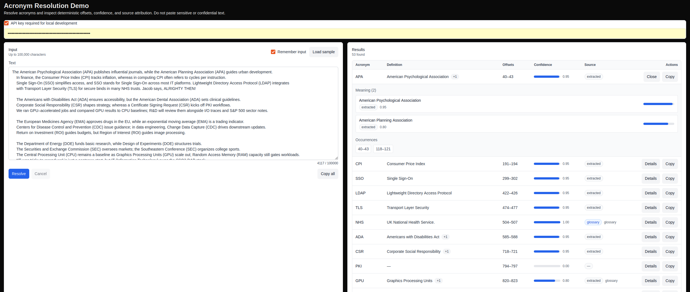

# Document Resolution

## Overview

Document Resolution is a public-facing monorepo for deterministic analysis of structured documents.

The core purpose of the project is to identify and resolve document-specific language in a traceable and reusable way, with a particular focus on:

- acronyms,
- defined terms,
- structural references.

The repository includes the core resolution engine, a public API service, a web application, infrastructure definitions, and a RAG demonstrator used to explore grounded versus baseline retrieval behaviour.

It also serves as a record of how I approached a broad technical problem: shaping the domain, breaking it into coherent components, and implementing it across packages, services, infrastructure, and application layers.

## Why this project exists

A large amount of important document meaning sits in local definitions rather than in general language.

In real documents, an acronym, quoted phrase, or structural reference is often introduced once and then reused throughout the rest of the text. If that meaning is not preserved, downstream systems can drift, misinterpret the document, or produce plausible but incorrect outputs.

This repository exists to explore and implement a more deterministic approach to that problem: extracting and resolving document-specific meaning in a way that is structured, testable, and reusable.

## What this repository contains

This monorepo contains:

- reusable Python packages for document resolution, domain logic, observability, and demo pipelines,
- a FastAPI service exposing public-facing endpoints,
- a Next.js web application for interacting with the system,
- Terraform infrastructure definitions,
- Docker and local development tooling,
- supporting test and dependency-checking utilities.

This is a public-facing version of the work. Some private or internal-only project elements were removed before publication.

## Architecture overview

At a high level, the repository is split into separate concerns:

- **apps/** contains user-facing applications,
- **packages/** contains reusable libraries and domain logic,
- **services/** contains deployable back-end services,
- **infra/** contains infrastructure definitions,
- **tools/** contains repository maintenance and utility scripts.

This separation is intentional. The goal is to keep domain logic reusable, keep deployment concerns isolated from library code, and make responsibilities easier to reason about across the system.

## Repository structure

```text
.
├── apps/
│   └── documentResolutionWeb/               # Next.js web application
├── infra/
│   └── terraform/                           # Infrastructure definitions
├── packages/
│   ├── document_resolution/                 # Main resolution engine
│   ├── document_resolution_core/            # Shared domain and service components
│   ├── document_resolution_observability/   # Logging and observability
│   ├── document_resolution_rag_demo/        # Grounded vs baseline RAG demonstrator
│   └── document_resolution_testkit/         # Test helpers and fixtures
├── services/
│   └── document_resolution_api/             # FastAPI public API service
├── tools/
│   └── check_deps.py                        # Dependency consistency checks
├── docker-compose.yml
├── pyproject.toml
├── package.json
└── README.md
````

## Key components

### `apps/documentResolutionWeb`

A Next.js application that provides a user-facing interface to the system. It includes the front-end application shell, UI components, and API route integration for resolution workflows.

### `packages/document_resolution`

The main resolution package. This contains the bulk of the NLP, heuristics, extraction logic, orchestration primitives, and wiring for acronyms, defined terms, and structural references.

### `packages/document_resolution_core`

Shared lower-level domain concepts and supporting service components used across the wider system.

### `packages/document_resolution_observability`

Observability and logging support, including middleware, request handling utilities, logger infrastructure, and related shared model types.

### `packages/document_resolution_rag_demo`

A demonstrator package used to explore grounded retrieval and compare it against baseline RAG behaviour. It sits alongside the main resolution engine because it is an application of the core system rather than part of the core resolution engine itself.

### `packages/document_resolution_testkit`

Shared test utilities, fixtures, and support helpers for package- and service-level testing.

### `services/document_resolution_api`

A FastAPI service exposing public endpoints for health checks, resolution requests, orchestration, and demo-related functionality. This is the main deployable back-end entry point for the repository.

### `infra/terraform`

Infrastructure definitions for provisioning supporting components such as PostgreSQL-related infrastructure and outputs.

### `tools`

Repository-level scripts for housekeeping and consistency checks. For example, `check_deps.py` helps verify dependency version alignment across packages and services.

## Design notes and known refinement areas

This repository is functional and deliberately structured, but some parts are more mature than others.

Some internal abstractions reflect earlier design iterations and would be simplified in a further refinement pass. For example, parts of `document_resolution_core` are currently lighter-weight than I would want in a more polished design. They do not prevent the system from running correctly, but they are areas where I would likely reduce indirection, remove weaker abstractions, and tighten package responsibilities.

A similar point applies to orchestration. The codebase currently has a generic orchestration layer in `document_resolution.orchestration` and a second API-facing orchestration layer in `public_api.core.orchestration`. That split is functional, but it also reflects the path the project took: the lower-level layer handles runner registration, target resolution, and generic state accumulation, while the API layer still owns chunked execution, timeout handling, and response-oriented execution concerns.

In practice, that means some orchestration control flow is duplicated across layers. I am aware of that trade-off. If I were continuing an active refinement pass, I would likely consolidate those responsibilities so the boundary is clearer. The likely end state would be either a genuinely reusable orchestration engine in `document_resolution` with a thin API adapter, or a deliberately lightweight runner layer in `document_resolution` with the API as the true orchestrator.

## Technology stack

This repository uses:

* **Python 3.13**
* **Poetry**
* **FastAPI**
* **Pytest**
* **mypy**
* **Ruff**
* **TypeScript**
* **Next.js**
* **pnpm**
* **Docker / Docker Compose**
* **Terraform**
* **PostgreSQL**

Some parts of the demonstrator also use retrieval and embedding-related components where appropriate.

## Design principles

A few principles shaped how this repository was put together:

* **Deterministic behaviour where possible**
  Preference is given to logic that is explicit, inspectable, and testable.

* **Clear separation of concerns**
  Reusable packages, deployable services, applications, and infrastructure are kept distinct.

* **Traceability over magic**
  The intention is that behaviour can be reasoned about rather than guessed at.

* **Extensibility**
  Even though the project was primarily developed by me, the structure aims to support future collaboration and extension.

* **Operational awareness**
  Logging, observability, environment handling, and deployment structure are treated as part of the system, not afterthoughts.

* **Agnostic design where practical**
  Core logic is intended to remain reusable across packages and execution contexts rather than tightly coupled to a single service or interface.

## Getting started

### Prerequisites

You will need:

* Python 3.13
* Poetry
* Node.js
* pnpm
* Docker
* Docker Compose

Depending on what you want to run locally, you may also need environment variables for services such as the API, database, and any external providers used by the demo components.

## Installation

### 1. Clone the repository

```bash
git clone <your-repository-url>
cd <repository-name>
```

### 2. Install Python dependencies

At the repository root:

```bash
poetry install
```

Some packages and services may also be managed independently through their own `pyproject.toml` files depending on how you prefer to work locally.

### 3. Install JavaScript dependencies

At the repository root:

```bash
pnpm install
```

### 4. Configure environment variables

Create the required local environment files for the services or apps you want to run.

Typical examples include:

* API configuration,
* database connection settings,
* front-end API base URL,
* provider keys required by demo components.

Refer to package- or service-specific configuration files and READMEs where present.

## Running the system

### Run with Docker Compose

From the repository root:

```bash
docker compose up --build
```

## Running the system

### Run with Docker Compose

From the repository root:

```bash
docker compose up --build
```

### Run database migrations

The migration tool used is [Alembic](https://alembic.sqlalchemy.org/en/latest/). Additional detail is available in `services/document_resolution_api/migrations/README.md`.

From the repository root:

1. `cd services/document_resolution_api`
2. run `make migrate`

If successful, the database schema should be created without errors.

### Populate seed data

From the repository root:

1. `cd services/document_resolution_api/src/public_api/db/seed`
2. run `python3 seed.py`

If successful, the script should complete with a confirmation message.

Current limitations of the seed dataset:

1. it is currently focused on acronym resolution,
2. it uses a simple general domain model rather than richer domain-specific examples,
3. provenance is intentionally minimal at this stage.

Once the above steps are completed successfully, from the repository root:

```bash
make ci-local
```

**Note** the population of seed Data is not required for `make ci-local` to work.

This is intended to approximate the local CI workflow, though environment-specific differences may still exist.

## Using the repository locally

### OpenAPI documentation

When the API is running locally, the FastAPI Swagger UI is available at:

`http://localhost:8001/docs`

To test the `/v1/resolve` endpoint, you will need to create an API key first. The CLI for that lives in `services/document_resolution_api/src/public_api/cli/api_keys.py`, with usage instructions at the top of the module.

The endpoint returns structured JSON for acronym, defined-term, and structural-reference resolution for a given input.

### Demo UI 

The demo UI is available at:

`http://127.0.0.1:3001/demo`

The current demo page focuses on acronym resolution. Provide an API key created via `services/document_resolution_api/src/public_api/cli/api_keys.py`, then submit input text to inspect resolved acronyms, offsets, confidence, source attribution, and ambiguity where present.

#### Example output


*Demo UI showing acronym resolution with offsets, confidence, source attribution, and surfaced ambiguity for conflicting meanings.*

### Running the RAG demonstrator

To run the RAG demonstrator locally, provide an OpenAI API key in the root `.env` file.

## Local development workflow

The normal local workflow is Docker-based from the monorepo root.

A typical workflow is:

1. start the local environment with Docker Compose,
2. run migrations or seed data if needed,
3. run tests, type checks, and linting for the area you are changing,
4. verify dependency consistency where relevant.

## Testing, linting, and type checking

Examples of useful commands include the following.

### Python tests

From the relevant package or service directory:

```bash
poetry run pytest
```

### Type checking

```bash
poetry run mypy .
```

### Linting

If Ruff is configured for the current package or service:

```bash
poetry run ruff check .
```

### Dependency consistency checks

From the repository root:

```bash
python tools/check_deps.py \
  packages/document_resolution/pyproject.toml \
  packages/document_resolution_core/pyproject.toml \
  packages/document_resolution_observability/pyproject.toml \
  packages/document_resolution_rag_demo/pyproject.toml \
  services/document_resolution_api/pyproject.toml
```

Adjust the list of files as needed for the set of packages you want to compare.

## How to read this repository

If you are new to the codebase, the most useful reading order is usually:

1. this top-level `README.md`,
2. `services/document_resolution_api/`,
3. `services/document_resolution_api/migrations/`,
4. `packages/document_resolution/`,
5. `apps/documentResolutionWeb/`,
6. `packages/document_resolution_rag_demo/`,
7. `infra/terraform/`.

That order gives a sensible path from entry points to core logic, then to UI and infrastructure.

## Current status

This is an active public engineering repository rather than a finished commercial product.

The codebase is intended to be useful in its own right while also showing how I approached architecture, package boundaries, service design, delivery structure, and technical problem decomposition across a non-trivial system.

## Future work

Areas that could be expanded further include:

* broader public documentation,
* deeper deployment guidance,
* richer demo scenarios,
* more complete environment examples,
* additional hardening and operational polish,
* clearer consolidation of orchestration responsibilities across package and API layers.

## Licence

This repository is licensed under the terms set out in the [LICENSE](./LICENSE) file.
